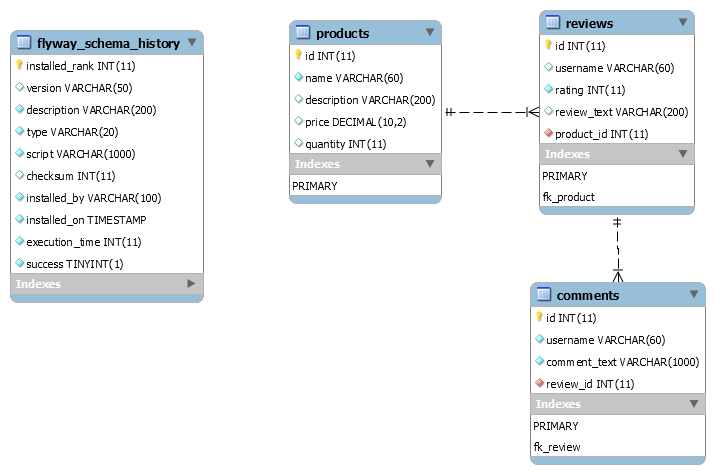

# Reviews API 

Supports operations for writing reviews and listing reviews for a product but with no sorting or filtering.

### Prerequisites

- MySQL installed and configured.
- If you don't want to change application.properties, configure the following settings in your SQL server:
    - Create a database called `ecommerce`.
    - Create a user with "readWrite" access to `ecommerce`.
        - Username = `dev_user`
        - Password = `password`

### API Documentation

- API documentation is created using the Swagger library.
- API documentation can be found at the following URL, once the application itself is running:
    - `http://localhost:8080/swagger-ui.html`

### Technical Notes

#### Database Structure

- Database Name: `ecommerce`
- Tables
    - products
    - reviews
    - comments
- Relationships
    - products to reviews, one-to-many
    - reviews to products, many-to-one
    - reviews to comments, one-to-many
    - comments to reviews, many-to-one
    

_Database Schema_

### Rubric

#### Code Quality

- Does the code work?
  - All code is functional (i.e. no errors are thrown by the code). Warnings are okay, as long as they are not a result of poor coding practices.
- Does the project follow good coding practices?
  - The project uses functions and loops where possible to reduce repetitive code. Comments are used as needed to document code functionality.

#### RDBMS

- The project demonstrates understanding of SQL DDL.
  - The project contains the necessary SQL scripts to create review, comment and product tables.
- The project shows proper use of relational model constraints.
  - The project contains the SQL to create foreign key constraints on review & comment tables. Review is related to Product. Comment is related to Review.
- The project demonstrates understanding of connecting an application to a relational database.
  - The project contains the following properties to properly connect to a relational database in Spring.
    Spring.datasource.url, spring.datasource.username, spring.datasource.password.

#### JPA

- The project demonstrates understanding of JPA.
  - The project contains the JPA entities for Product, Review & Comment.
- The project demonstrates understanding of primary key (id) generation in JPA.
  - The project contains JPA entities which use at least one of the available id generation strategies in JPA.
- The project shows proper use JPA data modeling.
  - The project contains JPA entities which are connected using JPA collections.

#### Spring Data JPA

- The project demonstrates understanding of Spring Data JPA.
  - The project contains Spring Data JPA repositories for Product, Review & Comment entities.
- The project shows proper use Spring Data JPA Repository Query methods
  - The project contains Spring Data JPA repositories with methods following the query keywords and return types.
  - https://docs.spring.io/spring-data/jpa/docs/current/reference/html/#repository-query-keywords
  - https://docs.spring.io/spring-data/jpa/docs/current/reference/html/#repository-query-return-types
- The project demonstrates usage of Spring Data JPA repositories.
  - The project contains the correct methods wired in at the provided controllers in the starter code.
- The project demonstrates usage Spring test framework.
  - The project has tests for all the methods in the Spring Data JPA repositories.
- The project shows proper use of H2 database for testing.
  - The project has tests for Spring Data JPA repositories that run against a H2 database.

### Reference Documentation
For further reference, please consider the following sections:

* [Official Apache Maven documentation](https://maven.apache.org/guides/index.html)

### Guides
The following guides illustrate how to use some features concretely:

* [Accessing JPA Data with REST](https://spring.io/guides/gs/accessing-data-rest/)
* [Accessing Data with JPA](https://spring.io/guides/gs/accessing-data-jpa/)
* [Accessing data with MySQL](https://spring.io/guides/gs/accessing-data-mysql/)